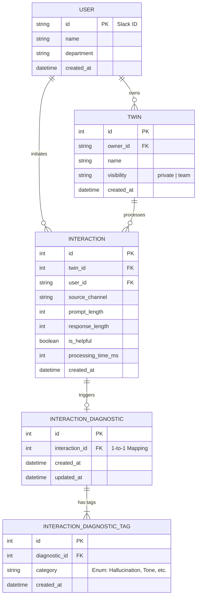

# 📊 AI Twin Analytics Dashboard

An enterprise analytics dashboard that turns AI Twin interaction logs into clear product, quality, and cost decisions.

This project connects user behavior with business outcomes, helping teams quantify network effects, prove AI ROI, and convert user feedback into concrete engineering priorities.

## 1. Tech Stack & Runtime

### Core Stack
* **Backend:** Python 3.10+, FastAPI (Modern web framework), SQLModel (Pydantic + SQLAlchemy ORM)
* **Frontend:** React 19, TypeScript, Vite 8, Tailwind CSS 4, Recharts
* **Tooling & DX:** `uv`

### Runtime Prerequisites
* **Node.js:** `>=20.19.0` (Required by Vite 8)
* **Python:** `3.10+`

---

## 2. Quick Start

### 2.1. Backend Setup & Data Seeding
Open a terminal to initialize the database and start the API:

```bash
cd backend

# Full reseed: Resets ai_twin.db, recreates tables, and seeds 30 days of mock data
uv run seed.py

# Start the FastAPI server
uv run uvicorn app.main:app --reload
```
* **API URL:** `http://localhost:8000`
* **Interactive Docs:** `http://localhost:8000/docs`

### 2.2. Frontend Dashboard Setup
Open a **new** terminal window:

```bash
cd frontend
npm install
npm run dev
```
* **Dashboard URL:** `http://localhost:5173`

---

## 3. Product & Engineering Modules

The dashboard is structured into four core modules, each designed to drive specific organizational actions:

### A. Growth & Onboarding
* **Focus:** Tracking the dual conversion funnel ("Registered -> Twin Created -> Twin Made Public").
* **Actionable Insight:** Monitors "Onboarding Friction." A low creation rate signals a need to simplify the setup flow, while a low public rate suggests privacy concerns, requiring trust-building UX or sharing incentives.

### B. Network Effects & Usage
* **Focus:** Channel distribution and the "Self-use" vs. "Colleague-use" ratio.
* **Actionable Insight:** The "Colleague-use" ratio quantifies the product's transition from a personal utility to enterprise knowledge infrastructure. High Slack usage (e.g., >90%) justifies prioritized engineering investment in Slack-specific features.

### C. Cost & Token Control
* **Focus:** "Average Cost per Helpful Colleague Solution" and token consumption distribution (Pareto/Whale detection).
* **Actionable Insight:** Tracks AI unit economics against traditional IT/HR ticket handling costs to show ROI. Pareto analysis identifies top consumers for targeted API rate-limiting to prevent budget overruns.

### D. Quality & Diagnostics
* **Focus:** Feedback-only quality mix (`Helpful vs Thumb-down`) and defect breakdown by category.
* **Actionable Insight:** 
    1.  **Circuit Breaker:** Serves as a threshold for deployment rollbacks if negative feedback spikes.
    2.  **Quality Readability:** Pair `Helpful vs Thumb-down (feedback-only)` with `Feedback Coverage` so teams can distinguish quality movement from feedback sparsity.
    3.  **Precision RAG Updates:** If a department (e.g., Finance) shows high `OutdatedInfo` tags, the team can bypass model tweaks and directly trigger a targeted RAG vector database update.

---

## 4. Technical Specifications

### 4.1. Technical Assumptions
To bound the scope of this dashboard and ensure the data model focuses on core business metrics, the following assumptions were made:
* **Data Availability:** Assumes all conversational logs from the LLM gateway are reliably flushed/streamed to the relational database (mocked via SQLite for this assignment).
* **Scope:** Currently designed for a single-tenant workspace (e.g., a single company's Slack workspace or internal domain).
* **Cost Proxy:** Assumes the backend acts as a Token Proxy, correctly logging `prompt_length` and `response_length` before returning payloads to the frontend.

### 4.2. Data Model
The architecture separates high-frequency interaction events from entity attributes to support high-performance analytical queries.



### 4.3. Seed & Simulation Semantics
The `seed.py` utility generates demo data with realistic business patterns:
* **Network Effects:** Colleague-call probability for `team` twins grows linearly from **30% to 50%** over the 30-day window to simulate organic adoption.
* **Cost Realism:** Interaction generation uses an **exponential distribution** to simulate "Whale" users. Processing latency is tied to response length (`300ms + response_len * 1.5`).
* **Diagnostic Integrity:** Every `thumb-down` triggers exactly one `InteractionDiagnostic` with 1-2 unique tags (e.g., `Hallucination`, `OutdatedInfo`, `Tone`, `InstructionsUnfollowed`).

### 4.4. KPI Formula Contracts
| Metric | Formula | Zero-denominator Behavior |
|---|---|---|
| `Active Rate` | `Active Users / Total Registered Users * 100` | `null` if `Total Registered Users = 0` |
| `Twin Creation Rate` | `Users with Twin / Registered Users * 100` | `null` if `Registered Users = 0` |
| `New User Activation Rate (7d)` | `Activated New Users Within 7 Days / New Registered Users * 100` | `null` if `New Registered Users = 0` |
| `Public Twin Rate` | `Public Twins / Created Twins * 100` | `null` if `Created Twins = 0` |
| `Avg Cost / Helpful Colleague Solution` | `Colleague Total Cost / Colleague Helpful Solutions` | `null` if denominator is `0` |
| `Helpful Rate (feedback-only)` | `Helpful / (Helpful + Thumb Down) * 100` | `null` if `(Helpful + Thumb Down) = 0` |
| `Thumb-down Rate (feedback-only)` | `Thumb Down / (Helpful + Thumb Down) * 100` | `null` if `(Helpful + Thumb Down) = 0` |
| `Feedback Coverage` | `(Helpful + Thumb Down) / Total Interactions * 100` | `0.0` if `Total Interactions = 0` |
| `Estimated Spend (USD)` | `Token Proxy Pricing(Input + Output)` | `0.0` when total tokens are `0` |

---

## 5. API Index

| Endpoint | Method | Purpose |
|---|---|---|
| `/` | `GET` | Service health check |
| `/api/metrics/kpi` | `GET` | Overall KPI health and period-over-period delta |
| `/api/metrics/trends` | `GET` | How interaction volume changes over time by source |
| `/api/metrics/sources` | `GET` | Where usage is coming from in the selected period |
| `/api/modules/growth/overview` | `GET` | Whether onboarding and twin activation are improving |
| `/api/modules/usage/source-mix` | `GET` | Channel mix trend (Slack DM / Channel / Web) |
| `/api/modules/usage/self-colleague-share`| `GET` | Whether colleague reuse is increasing |
| `/api/modules/cost/pareto` | `GET` | Cost concentration risk (who drives most spend) |
| `/api/modules/cost/efficiency` | `GET` | Cost per helpful colleague solution |
| `/api/modules/quality/overview` | `GET` | Overall quality trend and defect volume |
| `/api/modules/quality/department-risk` | `GET` | Which departments have the highest thumb-down risk |
| `/api/modules/quality/diagnostic-summary` | `GET` | Diagnostic coverage and defect category distribution |
| `/api/interactions/thumb-down/recent` | `GET` | Recent negative cases for quick triage |
| `/api/interactions/{interaction_id}/diagnostic` | `GET` | Diagnostic tags for a specific case |
| `/api/interactions/{interaction_id}/diagnostic` | `POST` | Manual diagnostic correction or backfill |

`/api/metrics/kpi` also includes overview card fields such as `active_users`, `active_rate_pct`, `new_user_activation_rate_7d_pct`, `colleague_usage_share_pct`, `helpful_rate_pct`, `thumb_down_rate_pct_feedback`, `feedback_coverage_pct`, and `estimated_spend_usd`.

---

## 6. Limitations & Roadmap

### Known Limitations
* Single-tenant architecture (Workspace level).
* SQLite-based storage (Optimal for local dev/demo scale).
* Token proxy cost modeling instead of direct cloud billing integration.

### Future Roadmap
1.  **Infrastructure:** Migrate to **PostgreSQL** and introduce **Kafka/Redis** for asynchronous telemetry logging.
2.  **Security:** Implement `UUIDv4` for primary keys to mitigate IDOR risks and add production-grade AuthN/AuthZ.
3.  **Real-time:** Implement **WebSockets** for live KPI updates and anomaly alerting.
4.  **Data Quality:** Decouple `Department` into a dedicated Dimension table (3NF) to support complex organizational hierarchies.
